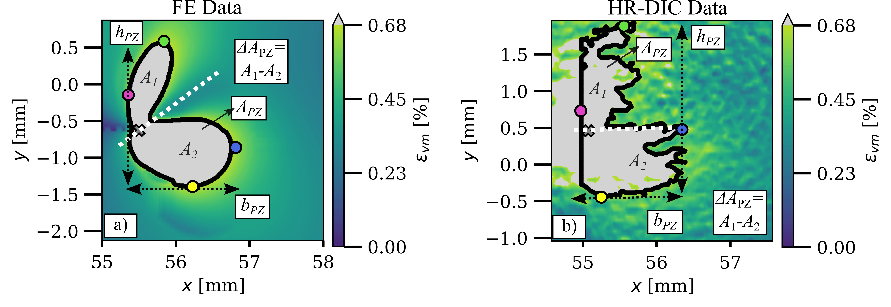

# Plastic zone evaluation tool

The plastic zone evaluation tool is utilised for the identification and description of the plastically deformed area at the crack tip. This can be achieved through the utilisation of numerical strain fields or strain fields determined experimentally using Digital Image Correlation (DIC). The contour recognition process serves as the fundamental foundation for the analysis. Geometric descriptors are then employed to provide a detailed and quantitative description of the area that has been previously identified.

This repository contains the code used to generate the results of the research article
[](https://doi.org/10.1016/j.engfracmech.2024.110664 )

```
Vanessa Schöne, Florian Paysan and Eric Breitbarth. (2024)
The relationship between crack front twisting, plastic zone and da/dN-dK curve of fatigue cracks in AA2024-T3. 
```

## Abstract
*TODO*

## Dependencies
*  <a href="https://www.python.org/downloads/release/python-310/" target="_blank">Python 3.10</a>

This tool is also compatible with CrackPy - Crack Analysis Tool in Python
*  <a href="https://github.com/dlr-wf/crackpy" target="_blank">CrackPy 1.X.X</a>


## Installation

1. Create a virtual environment of Python 3.10 and activate it.
2. Install the required packages using the following command:
```shell
pip install -r requirements.txt
```

The repository contains the following folders:
* `data_examples`: Examples of data structures for FE and DIC data
* `02_results`: Results obtained from the given examples.
* `utils`: Neccesary functions to read and process data inputs

## What is this all about?
Digital image correlation (DIC) is a modern optical and non-contact measurement method for determining movements and strains in material testing. The combination of DIC and fracture mechanics testing enables deeper insights into crack growth behaviour on a microscopic and macroscopic level. [**1**]
As a result of cyclic or monotonic loading, permanent plastic deformations, the so-called plastic zone, forms at the crack tip in ductile materials[**2**]. It's useful to know the shape and size of the plastic zone around a crack. This helps us understand how the plasticity effect affects the crack growth behaviour in solids.


## How does it work?
The specimen is described using a full-surface nodal displacement and strain field, so-called "Nodemaps", that can be determined using high resolution DIC or given by numerical data. The crack tip position must also be known (marked as 'X' in image below).  With the help of contour recognition based on a material-dependent threshold value, the plastically and elastically deformed area in front of the crack tip can be separated within the strain field. The relevant contours are identified via a case distinction and characterised by measuring the contour using descriptors.


|  |
|:--:|
| **_Overview of contour evaluation in high resolution DIC data and case distinction_** |

By analyzing the contour extreme points we can obtain several descriptors such as height, width, total area. 

|  |
|:--:|
| **_Analysis and description of the plastic zones within numerical finite elemente and high resolution DIC data_** |

## What is the output?
See `02_results` for given data in  `data_examples`:
* Visualization of the contour itself and mapped on the nodemap
* .csv file containing crack tip position, neccesary image metadata and all contour descriptors
* .pickle file additionally containing the contours itself and all variables set during data evaluation


 ## License and Limitations
The package is developed **for research only and must not be used for any production or specification purposes**. 
The Package is **under current development and all functionalities are on a prototype level**. 
Feel free to use the code, however, **we do not guarantee in any form for its flawless implementation and execution**.

 
## Get in touch
If you are interested in the code, or in our work in general, feel free to contact me 
via email at [vanessa.schoene@dlr.de](mailto:vanessa.schoene@dlr.de) or [vanessa.schoene5@gmail.com](mailto:vanessa.schoene5@gmail.com)

## Intellectual Property and Authorship 
This package is property of the German Aerospace Center (Deutsches Zentrum für Luft- und Raumfahrt e.V. - DLR) 
and was developed in the Institute of Materials Research. Feel free to check out our [LinkedIn channel](https://www.linkedin.com/company/dlr-wf).

References:

1. **Hebert J. et al. (2022)** The application of digital image correlation (DIC) in fatigue experimentation: A review. 
   _FFEMS Volume46, Issue4_ 
   [https://doi.org/10.1007/s10704-006-6631-2](https://doi.org/10.1007/s10704-006-6631-2)
2. Plastic zone - an overview
[https://www.sciencedirect.com/topics/engineering/plastic-zone] (https://www.sciencedirect.com/topics/engineering/plastic-zone)
